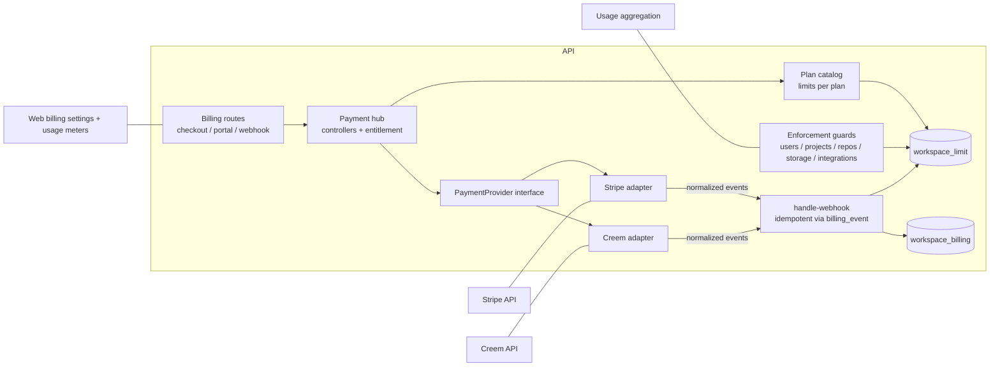
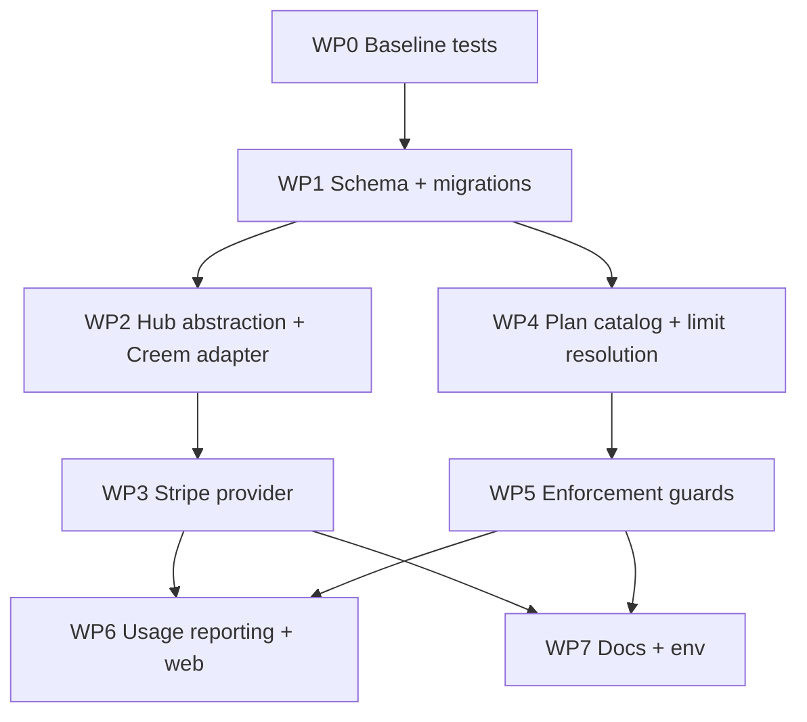

# Stripe Payment Hub and Plan-Based Limits — Implementation Plan

Status: Draft for review
Date: 2026-10-08
Companion document: `docs/billing/stripe-payment-hub-requirements.md`
Scope: `apps/api`, `apps/web`, `apps/docs`, `.env.sample`

## 1. Summary

The work is divided into eight work packages (WP0–WP7) that can be delivered and reviewed incrementally on a single branch. The core structural change is a payment-provider abstraction around the existing `apps/api/src/billing` module, followed by a Stripe adapter, a generalized plan-limit catalog with six dimensions, and enforcement at five write paths. The plan preserves the two established contracts of the current design: billing writes limits while the API only reads them, and limit resolution is workspace override → instance default → unlimited.

Estimated total effort: 3–4 weeks for one engineer, with WP2 and WP4 reviewable in isolation and WP3 being the largest single package.

## 2. Current-state inventory

| Area | Files | Notes |
| --- | --- | --- |
| Billing config | `apps/api/src/billing/config.ts` | Plan/interval types, Creem product env keys, `isBillingEnabled()` |
| Creem client | `apps/api/src/billing/creem-client.ts` | Checkout, seat update (`proration-charge`), portal link |
| Routes | `apps/api/src/billing/index.ts` | Webhook, billing read, checkout, portal; owner/admin guard |
| Controllers | `apps/api/src/billing/controllers/*` | `create-checkout`, `handle-webhook`, `get-workspace-billing`, `sync-seats`, `require-entitlement` |
| Webhook types | `apps/api/src/billing/creem-webhooks.d.ts`, `subscription-state.ts` | Creem event types; billable status set |
| Limits | `apps/api/src/plan-limits/*` | Repo binding limit resolution and quota (HTTP 402, conversion event) |
| Schema | `apps/api/src/database/schema.ts` | `workspace_billing` (Creem columns), `workspace_limit`, `trial_grant`, `billing_event` |
| Web | `apps/web/src` billing settings routes | Checkout/portal buttons, billing state display |

## 3. Target architecture



Proposed module layout (new files marked):

```text
apps/api/src/billing/
  config.ts                 (extended: BILLING_PROVIDER, provider credential resolution)
  plans.ts                  (new: plan catalog with limit dimensions)
  subscription-state.ts     (unchanged)
  providers/
    types.ts                (new: PaymentProvider interface + normalized event types)
    resolve.ts              (new: active provider resolution)
    creem/
      client.ts             (moved from creem-client.ts, implements the interface)
      webhook.ts            (new: signature verification + event normalization)
    stripe/
      client.ts             (new: checkout, portal, seat sync)
      webhook.ts            (new: signature verification + event normalization)
  controllers/              (unchanged shape; depend only on the interface)
apps/api/src/plan-limits/
  resolve-limits.ts         (generalized to all dimensions)
  repository-binding-quota.ts (retained)
  quotas/
    users.ts                (new)
    projects.ts             (new)
    repositories.ts         (new: workspace-level)
    storage.ts               (new)
    integrations.ts          (new)
  usage.ts                  (new: usage aggregation per dimension)
```

## 4. Work packages

### WP0 — Baseline and safety net

Goal: freeze current behavior before refactoring.

- Record current billing API response shapes (`get-workspace-billing`, checkout, portal) as contract tests.
- Add characterization tests for `handle-webhook` with representative Creem payloads (checkout completed, subscription active, canceled, past due, seat change).
- Add a test for `resolveRepositoryBindingLimits` covering all three resolution branches.

Definition of done: the characterization suite passes on `main` without modification.

### WP1 — Database schema and migrations

Goal: provider-neutral billing identifiers and extended limit columns.

Changes:

- `workspace_billing`: add `provider` (text, not null, default `'creem'`); rename `creem_customer_id` → `customer_id`, `creem_subscription_id` → `subscription_id`, `creem_product_id` → `product_id`. Drizzle schema updated in `apps/api/src/database/schema.ts`; migration generated with `drizzle-kit generate`. The migration is a column rename plus a default backfill, so it is metadata-only for existing rows.
- `workspace_limit`: add nullable `max_users`, `max_projects`, `max_repositories`, `storage_bytes`, `max_integrations`. Retain `max_repositories_per_project` and `updated_at`.
- Update all references to the renamed columns (`handle-webhook.ts`, `get-workspace-billing.ts`, `sync-seats.ts`, `subscription-state.ts`, `creem-client.ts` call sites).

Definition of done: migrations apply cleanly on a cloud-shaped database; existing tests pass; API responses keep the old field names via aliases where clients read them (per NFR-4 of the requirements).

### WP2 — Payment hub abstraction and Creem refactor

Goal: all billing logic is provider-agnostic; Creem becomes the first adapter.

Changes:

- `providers/types.ts`: the `PaymentProvider` interface (see FR-1.1) and a provider-neutral `BillingWebhookEvent` type; move the existing event vocabulary from `handle-webhook.ts` into this module.
- `providers/creem/client.ts`: wrap the current `creem-client.ts` operations behind the interface (checkout, portal, seat update with `proration-charge`).
- `providers/creem/webhook.ts`: move `constructWebhookEvent` usage behind `verifyWebhookEvent`; map Creem event types to the normalized vocabulary (identity mapping for existing names).
- `providers/resolve.ts`: resolve the active provider from `BILLING_PROVIDER` (default `creem`); `isBillingEnabled()` consults the selected provider's credentials.
- `config.ts`: generalize `productIdFor` / `planForProductId` to a per-provider price lookup (Creem: products; Stripe: prices).
- `controllers/create-checkout.ts`, `controllers/sync-seats.ts`, `billing/index.ts`: replace direct Creem client calls with the resolved provider; mount webhooks at `/webhook/creem` while keeping the legacy `/webhook` as a Creem alias for one release.
- `handle-webhook.ts`: consume only normalized events; no provider-specific fields in the controller.

Tests: unit tests for provider resolution (missing credentials, unknown provider value, default); existing characterization tests continue to pass unchanged (they must not be edited, which proves behavior preservation).

### WP3 — Stripe provider

Goal: full Stripe parity, selectable with `BILLING_PROVIDER=stripe`.

Changes:

- Dependency: add `stripe` to `apps/api/package.json` (server SDK, no bundling in the web app).
- `providers/stripe/client.ts`:
  - `createCheckoutSession`: Stripe Checkout Session, `mode: subscription`, one line item with the plan price; quantity = seats (team) or 1 (personal); `subscription_data.metadata` (`workspaceId`, `plan`, `interval`); `customer_email`; `client_reference_id = workspaceId`; success/cancel URLs on the billing settings route.
  - `createCustomerPortalLink`: Billing Portal session with a configurable `STRIPE_PORTAL_CONFIGURATION_ID` (optional; falls back to the dashboard default configuration).
  - `updateSubscriptionSeats`: update the subscription item quantity, honoring `STRIPE_SEAT_PRORATION` (`always_invoice` default, `create_prorations`, `none`).
- `providers/stripe/webhook.ts`:
  - Signature verification with `stripe.webhooks.constructEvent` and `STRIPE_WEBHOOK_SECRET`; raw body required (Hono raw body handling must be preserved; verify no JSON middleware consumes the stream first).
  - Normalization map:
    - `checkout.session.completed` → `checkout.completed` (read subscription id, customer id, price id, and metadata from the session; fall back to expanding the subscription when metadata is absent)
    - `customer.subscription.updated` / `customer.subscription.created` → status mapping: `active`→`active`, `trialing`→`trialing`, `past_due`→`past_due`, `canceled`/`unpaid`→`canceled`, `paused`→`paused`; `cancel_at_period_end` true → `scheduled_cancel`
    - `customer.subscription.deleted` → `subscription.expired`
    - `invoice.paid` → refresh `current_period_end`
    - `invoice.payment_failed` → `subscription.past_due`
  - Map the Stripe price id to a plan/interval via the env price table (mirror of `planForProductId`).
- `config.ts`: `STRIPE_SECRET_KEY`, `STRIPE_WEBHOOK_SECRET`, `STRIPE_PRICE_*` keys; `isBillingEnabled()` for the Stripe case.
- Route: `POST /webhook/stripe`, excluded from session auth, same `billing_event` idempotency ledger (Stripe event ids).

Tests: unit tests for the normalization map over recorded Stripe payloads (all statuses, missing metadata, seat change, replay); integration test of the webhook route with a signed payload (test-mode secret); failure test for invalid signatures (HTTP 400, no state change).

Definition of done: acceptance criteria 1–4 of the requirements pass in Stripe test mode.

### WP4 — Plan catalog and generalized limit resolution

Goal: a single source of truth for plan limits; one resolution path for all dimensions.

Changes:

- `billing/plans.ts`: the plan catalog. Example shape (values are placeholders for the pricing decision, not commitments):

```ts
export type LimitDimension =
  | "users"
  | "projects"
  | "repositoriesPerProject"
  | "repositories"
  | "storageBytes"
  | "integrations";

export interface PlanLimits {
  maxUsers: number | null;
  maxProjects: number | null;
  maxRepositoriesPerProject: number | null;
  maxRepositories: number | null;
  storageBytes: number | null;
  maxIntegrations: number | null;
}

export const PLAN_LIMITS: Record<Plan, PlanLimits> = {
  personal: { maxUsers: 1, maxProjects: 3, maxRepositoriesPerProject: 2, maxRepositories: 6, storageBytes: 1_000_000_000, maxIntegrations: 2 },
  team:     { maxUsers: null, maxProjects: null, maxRepositoriesPerProject: 10, maxRepositories: null, storageBytes: 10_000_000_000, maxIntegrations: 10 },
};
```

- `plan-limits/resolve-limits.ts`: generalize to `resolveLimit(workspaceId, dimension)` with the existing resolution order (workspace override → env default → unlimited). Keep `resolveRepositoryBindingLimits` as a thin wrapper for the existing call sites.
- Billing writes limits: in `handle-webhook.ts`, when a subscription activates or changes plan, write the catalog values for the mapped plan into `workspace_limit` (single upsert in the same transaction as the `workspace_billing` update).
- Trial/founding-free: write the trial limit set on `getOrCreateWorkspaceBilling` initialization so trials are explicitly limited (FR-3.5).

Tests: table-driven tests for resolution (override, env default, unlimited, invalid env values); test that a subscription change rewrites `workspace_limit` transactionally.

### WP5 — Limit enforcement at the write paths

Goal: enforce all six dimensions with one error contract.

Shared pieces first:

- `plan-limits/quotas/limit-error.ts`: a generalized `LimitExceededError` (HTTP 402, body `{ code: "limit_exceeded", dimension, used, limit }`); `BindingLimitExceededError` becomes an alias or a subclass to keep existing clients working.
- `plan-limits/usage.ts`: per-dimension usage queries, each a single indexed aggregate (counts via `count(*)` on the relevant table; storage via a maintained sum, see below).

Enforcement points:

| Dimension | Guard location | Check |
| --- | --- | --- |
| Users | Workspace invite/create-member controllers (before insert and before sending the invitation email) | `count(workspace_user) >= maxUsers` |
| Projects | Project create controller | `count(projects) >= maxProjects` |
| Repositories (per project) | Existing `assertRepositoryBindingQuota` (retained) | unchanged |
| Repositories (workspace) | Repository binding create/reactivate controllers | `count(active git bindings in workspace) >= maxRepositories` |
| Storage | Presigned upload initiation in `apps/api/src/storage` | `currentUsageBytes + objectSize > storageBytes` |
| Integrations | Integration create/reactivate controllers (`isActive` false → true) | `count(active integrations in workspace) >= maxIntegrations` |

Storage usage aggregate: extend the attachment/object metadata with the stored size (already known at upload completion) and keep a per-workspace sum; reconcile the sum from the S3 listing on a schedule (existing scheduler/cron infrastructure, croner). If sizes are not currently persisted, persist them in this package before the quota goes live.

Conversion events: publish `limit_exceeded` with the dimension from each guard, reusing `publishEvent`; keep `integration.binding_quota_exceeded` publishing unchanged.

Race policy: accept transient overshoot for counts (documented precedent in `repository-binding-quota.ts`); storage reconciles after upload (FR-5.8).

Tests: integration tests per guard (pass at limit−1, refuse at limit, unlimited passes); error body shape tests; seat-refusal test verifying the invite is refused before a provider seat update is attempted.

### WP6 — Usage reporting and web app

Goal: visibility and conversion surfaces.

API:

- Extend the workspace billing response (`get-workspace-billing`) with a `usage` object: per dimension `{ used, limit, enforced }`, or add `GET /billing/{workspaceId}/usage` if response size becomes a concern. Storage usage comes from the aggregate; counts from `usage.ts`.

Web (`apps/web/src`):

- Billing settings page: render usage meters per dimension with the limit; keep provider-agnostic wording ("manage subscription" rather than Creem-specific copy).
- Handle HTTP 402 responses in the relevant mutations: surface an upgrade prompt naming the dimension (invite form, project creation, repo binding, upload, integration creation).
- Verify the checkout success redirect path (`?checkout=success`) works for both providers.

Tests: web tests for the billing page rendering usage; a test for the 402 upgrade prompt on at least one path.

### WP7 — Configuration, documentation, and rollout support

- `.env.sample`: add `BILLING_PROVIDER` (commented default `creem`), `STRIPE_SECRET_KEY`, `STRIPE_WEBHOOK_SECRET`, `STRIPE_PRICE_*`, `STRIPE_SEAT_PRORATION`, and the six `KANEO_MAX_*` instance defaults, following the existing comment style.
- `apps/docs`: add a Cloud billing configuration page covering both providers: Creem setup (existing), Stripe setup (prices for the four plan/interval combinations, webhook endpoint URL with the events to subscribe, portal configuration, test mode), and the plan-limit configuration reference (catalog + instance defaults).
- OpenAPI: keep billing routes `hide: true` for the self-hosted reference; update route descriptions to be provider-neutral (currently "Create a Creem checkout session…").

## 5. Sequencing and dependencies



WP3 and WP4 can proceed in parallel after WP1/WP2. Suggested milestones:

1. M1 (end of week 1): WP0–WP2 merged; Creem behavior provably unchanged.
2. M2 (end of week 2): WP3 + WP4 merged behind `BILLING_PROVIDER=stripe`; Stripe test-mode checkout works end to end on staging.
3. M3 (end of week 3): WP5 + WP6 merged; all dimensions enforced and visible.
4. M4 (end of week 4): WP7 complete; production cutover runbook executed.

## 6. Testing strategy

- Characterization (WP0): prove the refactor is behavior-preserving; these tests must never be edited in WP2.
- Unit: provider resolution, event normalization maps (recorded payloads for both providers), price-id → plan mapping, proration option handling, limit resolution table tests, plan catalog shape.
- Integration: webhook routes (signature, idempotency, replay, out-of-order), all six enforcement guards, transactional limit rewrites on subscription change, storage aggregate reconciliation.
- Manual staging pass: Stripe test mode — subscribe, change seats, cancel at period end, cancel immediately, payment failure (test card), portal management; repeat the critical paths on Creem to confirm no regression.
- Existing suites: `vp run test:run` (unit) and the integration suite must pass with billing disabled (self-hosted default) and with each provider enabled in test configuration.

## 7. Rollout and cutover

1. Deploy WP1+WP2 with `BILLING_PROVIDER` unset (defaults to Creem). Verify webhook processing on the legacy path.
2. Configure the Stripe webhook endpoint in the Stripe dashboard (`checkout.session.completed`, `customer.subscription.*`, `invoice.paid`, `invoice.payment_failed`) pointing at `/webhook/stripe`.
3. Validate end to end in Stripe test mode on staging (M2).
4. Switch the production instance to `BILLING_PROVIDER=stripe` during a low-traffic window. Existing active subscriptions continue to be served from `workspace_billing` (provider column reflects their origin); new checkouts use Stripe. Mixed operation is supported read-only: entitlements of pre-existing Creem subscriptions remain valid until they expire or are migrated operationally.
5. Keep the Creem adapter and the legacy webhook path for one release, then remove the alias in a follow-up.

Rollback: setting `BILLING_PROVIDER=creem` (or unsetting it) restores the previous behavior; the schema changes are renames plus additive columns and are backward compatible for the Creem code path.

## 8. Risks and mitigations

| Risk | Impact | Mitigation |
| --- | --- | --- |
| Renaming billing columns breaks reporting or external integrations reading `creem_*` | Medium | Keep API response field aliases for one release (NFR-4); communicate the rename in the changelog |
| Webhook raw body is consumed by middleware before signature verification | High (security) | WP3 includes an explicit raw-body test; verify Hono route ordering early in the package |
| Out-of-order webhook delivery corrupts subscription state | Medium | Idempotency ledger plus last-write-wins with `updated_at`; ignore events older than the stored state (add `event_created` comparison) |
| Storage usage aggregate drifts from the S3 source of truth | Medium | Persist object sizes at upload completion; scheduled reconciliation; quota is enforced on the aggregate with a documented tolerance |
| Seat sync race between invite and webhook | Low | `maxUsers` guard refuses invites before any provider call; provider update is retried on the next membership change |
| Stripe price/plan mapping misconfiguration (wrong env price id) | Medium | Startup validation: each configured `BILLING_PROVIDER=stripe` instance warns when a price env var is missing; checkout refuses unknown price ids with HTTP 400 |
| Founding-free and trial workspaces accidentally limited before the catalog exists | Medium | WP4 ships the trial limit set in the same change as the enforcement guards; guards default to unlimited when no `workspace_limit` row and no env default exist |

## 9. Definition of done

- All acceptance criteria in the requirements document pass in Stripe test mode and on the Creem regression pass.
- The characterization tests from WP0 pass unmodified.
- Migrations apply cleanly forward and are reversible (drizzle-generated down migrations where supported).
- `.env.sample` and `apps/docs` describe both providers and all limit defaults.
- No billing route, controller, or test imports a provider SDK outside `providers/*`.
