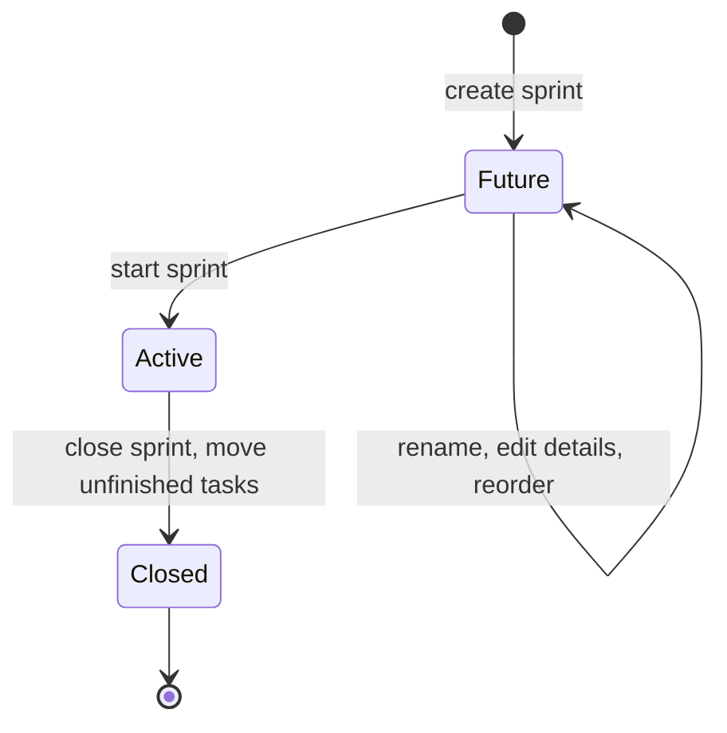
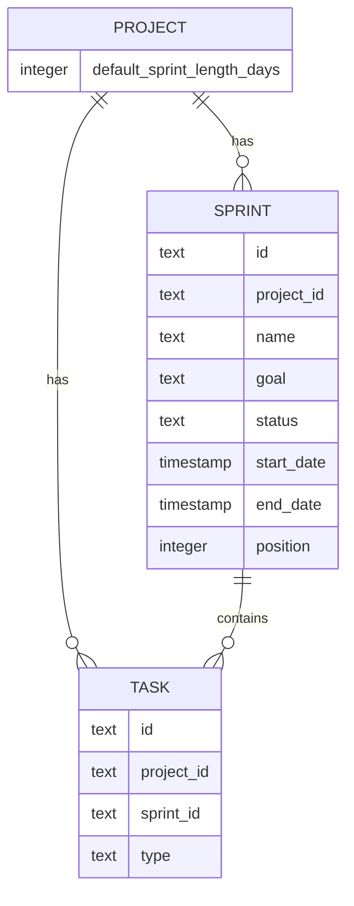
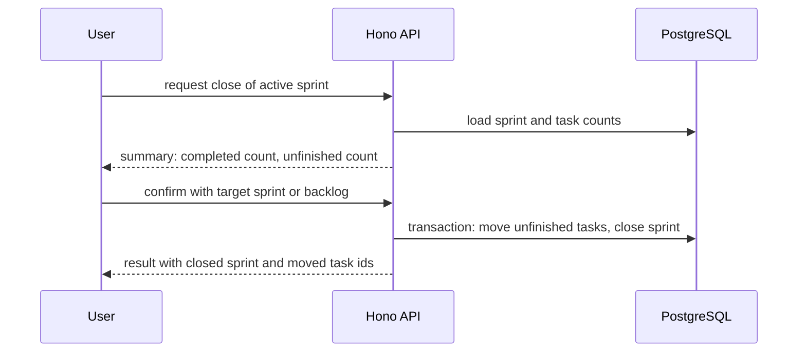

# Sprint Planning for Kaneo — Requirements and Implementation Plan

This document specifies the requirements for adding Jira-style sprint planning to Kaneo and the plan for implementing it. It relies on the feature list and the gap analysis prepared alongside it, both verified against the codebase.

## 1. Purpose and Scope

The objective is to give every Kaneo project an iterative planning layer: tasks are assigned to sprints, one sprint is active at a time, unfinished work is carried into a selected target sprint when a sprint closes, and completed work remains attached to the closed sprint as a permanent history of implementation. Jira serves as the behavioural reference. The scope covers the sprint data model, lifecycle, assignment rules, project settings, planning views, realtime delivery, and the typed REST API. Burndown reporting is out of scope for the first release.

## 2. Glossary

| Term | Definition |
|------|-----------|
| Sprint | A time-boxed iteration within a project, with a name, goal, start date, end date, and status. |
| Active sprint | The single sprint per project that is currently running. |
| Future sprint | A sprint that has been created but not started. |
| Closed sprint | A sprint that has been completed; it is immutable and retains its completed tasks. |
| Backlog | The set of tasks with no sprint assignment; it is the default container for non-bug tasks. |
| Finished task | A task whose column is final, per the existing taskIsCompleted rule. |

## 3. Sprint Lifecycle



## 4. Functional Requirements

### 4.1 Data Model and Settings

| ID | Requirement | Acceptance Criteria |
|----|-------------|---------------------|
| FR-1 | The system stores sprints per project with name, goal, start date, end date, status, and position. | A sprint can be created, persisted, and reloaded with all attributes intact. |
| FR-2 | Every task carries a nullable sprint reference; null means backlog. | Assigning and clearing the reference moves the task between the sprint and the backlog without data loss. |
| FR-3 | Every task carries a type attribute that at minimum distinguishes Bug from the general task type. | The type is visible on the task, settable at creation, and ignored by the repository syncs. |
| FR-4 | Project settings include a default sprint length in days. | The setting is stored per project, editable with the project update permission, and applied when a sprint starts without an explicit end date. |
| FR-5 | Closed sprints and their task assignments are immutable. | Any attempt to modify a closed sprint or reassign a task into it is rejected with a clear error. |

### 4.2 Sprint Management

| ID | Requirement | Acceptance Criteria |
|----|-------------|---------------------|
| FR-6 | A user with the project update permission can create, rename, edit, reorder, start, and close sprints within a project. | All operations succeed for an authorised user and are rejected for an unauthorised one. |
| FR-7 | Creating a sprint accepts an optional goal and date range and appends it to the future sprint list. | A new sprint appears at the end of the future sprint list with the given attributes. |
| FR-8 | Future sprints can be renamed, have their details edited, and be reordered; the active sprint allows editing only the goal and end date. | Renaming and reordering future sprints succeeds; editing the start date of the active sprint is rejected. |
| FR-9 | Starting a sprint sets it active, stamps the start date (defaulting to today), and derives the end date from the entered dates or the default length. Only one sprint per project is active. | Starting a second sprint while one is active is rejected. |
| FR-10 | Closing a sprint requires a target (a future sprint or the backlog) and moves every unfinished task of the sprint to that target in a single transaction. | On confirmation, all unfinished tasks are moved; finished tasks remain in the closed sprint; a failure changes nothing. |
| FR-11 | The sprint assignment field of a task offers only the active sprint, future sprints, and the backlog. | Closed sprints never appear as assignment targets in the UI or the API. |

### 4.3 Assignment Defaults and Restrictions

| ID | Requirement | Acceptance Criteria |
|----|-------------|---------------------|
| FR-12 | A newly created task of type Bug is assigned automatically to the active sprint when one exists, otherwise to the backlog. | Creating a bug during an active sprint places it in that sprint; creating one with no active sprint places it in the backlog. |
| FR-13 | A newly created task of any type other than Bug is assigned to the backlog. | New non-bug tasks appear in the backlog. |
| FR-14 | The sprint assignment of an existing task can be changed only to the active sprint, a future sprint, or the backlog, and only if the task is not already in a closed sprint. | The API validates the target status and the task's current sprint, and rejects closed sprints in both directions. |
| FR-15 | Sprint changes are broadcast in real time to every project member. | All connected clients refresh their sprint and board caches when another user changes a sprint. |

### 4.4 Views

| ID | Requirement | Acceptance Criteria |
|----|-------------|---------------------|
| FR-16 | The backlog view shows the active sprint, ordered future sprints, the backlog, and a collapsed closed-sprint history section. | The view renders all sections with correct task membership. |
| FR-17 | Task rows and the task details show the sprint, editable within the assignment restrictions. | The sprint field on a task in a closed sprint is read-only. |
| FR-18 | The task details allow selecting a sprint among the permitted targets. | Selecting a target updates the assignment; selecting the backlog clears it. |
| FR-19 | Project settings allow editing the default sprint length in days. | The value persists and is validated as a positive integer. |

## 5. Business Rules

| ID | Rule |
|----|------|
| BR-1 | Exactly one sprint per project may have the status active. |
| BR-2 | A sprint cannot be closed unless its status is active. |
| BR-3 | Tasks are never assigned to closed sprints, and tasks in closed sprints cannot be moved out, so the history of implementation stays intact. |
| BR-4 | The close operation requires an explicit target: a future sprint of the same project or the backlog. |
| BR-5 | The default sprint length setting is a positive integer number of days; it is used for prefilling only and never overrides explicitly entered dates. |
| BR-6 | Sprint names are unique within a project. |
| BR-7 | A task is unfinished for the close workflow when its column is not final, per the existing taskIsCompleted rule. |
| BR-8 | The sprint and type fields are excluded from GitHub, Gitea, and GitLab synchronisation payloads. |

## 6. Data Model



Schema additions in apps/api/src/database/schema.ts:

```ts
// sprints table (new)
sprintTable: id, projectId, name, goal, status ("future" | "active" | "closed"),
             startDate, endDate, position, createdAt, updatedAt

// tasks table (alter)
taskTable.sprintId -> sprintTable.id (nullable, null = backlog, set null on delete)
taskTable.type     -> "bug" | "task" (nullable for legacy rows)

// projects table (alter)
projectTable.defaultSprintLengthDays -> integer (default 14)
```

The migration backfills nothing: existing tasks keep a null sprint, which is the backlog, matching the required default behaviour.

## 7. API Design

All endpoints follow the existing OpenAPI-typed route pattern with workspace access middleware. Sprint lifecycle operations require the project update permission; task assignment requires the task update permission.

| Method | Path | Purpose |
|--------|------|---------|
| GET | /sprint/{projectId} | List sprints with status and task counts, ordered by position. |
| POST | /sprint/{projectId} | Create a future sprint with an optional goal and date range. |
| PUT | /sprint/{id} | Rename or edit details, respecting the status rules. |
| POST | /sprint/reorder/{projectId} | Update positions of future sprints. |
| POST | /sprint/start/{id} | Start a future sprint, enforcing the single active sprint rule. |
| POST | /sprint/close/{id} | Close the active sprint; the body carries the target sprint id or null for the backlog. |
| PUT | /sprint/task/{taskId} | Set or clear the sprint of a task, validated against FR-14. |

The task create endpoint gains an optional type and sprint field; the task responses expose type and sprintId.

## 8. Close Sprint Sequence



## 9. User Interface Specification

| Area | Specification |
|------|---------------|
| Planning view | The backlog route gains sprint sections above the backlog: an active sprint summary and ordered future sprints. Closed sprints appear in a collapsed history section at the bottom. Sprint sections show name, dates, and task counts, with actions for authorised users. |
| Create and edit sprint | A lightweight dialog for name, goal, and dates, prefilled with sensible defaults; inline rename on the section header. |
| Start sprint | A confirmation dialog showing the derived date range from the default length. |
| Close sprint wizard | Step one presents the summary of finished and unfinished tasks. Step two requires selection of the target sprint or the backlog from permitted options. Step three executes and reports the moved tasks. |
| Task details | A sprint selector limited to the active sprint, future sprints, and the backlog; read-only for tasks in closed sprints. |
| Project settings | The project settings surface gains the default sprint length in days. |

## 10. Non-Functional Requirements

| ID | Requirement |
|----|-------------|
| NFR-1 | Sprint operations respond within the same performance budget as existing project operations. |
| NFR-2 | The close operation is transactional; a failure leaves the sprint and all task assignments unchanged. |
| NFR-3 | The schema migration is backward compatible and reversible in development environments. |
| NFR-4 | All new endpoints validate input and enforce permissions identically to the existing API. |
| NFR-5 | The UI remains fully functional for projects that never use sprints; sprint UI is additive and hidden when no sprints exist unless a sprint is created. |
| NFR-6 | Accessibility: all new dialogs and interactions have keyboard alternatives. |

## 11. Implementation Plan

The plan is organised into commits on the feat/sprint-planning branch. Durations are indicative for one developer.

| Phase | Contents | Exit Criteria |
|-------|----------|---------------|
| 0. Documents | Feature list, gap analysis, and this plan, verified against the codebase. | Documents committed to docs/sprints. |
| 1. Data model | Drizzle schema for the sprint table, task sprint and type columns, project default length; migration, journal, and snapshot. | Migration and rollback pass on a populated development database. |
| 2. Sprint CRUD | API endpoints for create, list, update, and reorder, mounted in the typed API. | All CRUD operations pass tests and permission checks. |
| 3. Lifecycle | Start and close operations, close wizard UI, transactional move of unfinished tasks, assignment restrictions, default routing for bugs and other types. | The full lifecycle passes end-to-end tests, including guardrails BR-1 to BR-8. |
| 4. Views | Sprint sections in the backlog view, sprint selector in the task details, project setting, realtime invalidation, i18n strings. | The planning view handles an empty state, several future sprints, and reordering. |
| 5. Hardening | Sprint history section, additional events, integration review, docs refresh. | Documentation and API references updated; integration tests pass. |

## 12. Testing Strategy

| Layer | Coverage |
|-------|----------|
| Unit tests | Date prefilling from the default length, status transition guards, target validation, default routing rules. |
| Integration tests | API endpoints with permissions, the transactional close operation, migration up and down. |
| End-to-end tests | Create, start, close with carry-over, and history inspection through the UI. |
| Regression focus | Repository syncs continue to work with the new task fields; projects that do not use sprints behave as before. |

## 13. Risks and Mitigations

| Risk | Impact | Mitigation |
|------|--------|------------|
| Hand-written migration diverges from the generated snapshot. | Future drizzle-kit generate runs produce a duplicate diff. | The snapshot is derived from the previous one with the same shapes as drizzle-kit emits; the next generate run must be inspected. |
| Permission statement is missing on existing workspace roles. | Sprint features broken for existing workspaces. | The first release reuses the project update permission, which every admin and owner role already carries. |
| Close operation moves a large number of tasks. | Slow transaction. | A single set-based update within one transaction; counts computed before execution. |
| Repository sync conflicts. | Broken integrations. | Sprint and type fields are ignored by the existing explicit-field syncs; verify in review. |
| Scope creep toward analytics. | Delayed release. | Burndown and reporting explicitly deferred to a later release. |

## 14. Open Questions

| # | Question | Suggested Default |
|---|----------|-------------------|
| Q1 | Should the type set include more values than Bug and Task, for example Feature and Story? | Start with Bug and Task; extend later without schema change. |
| Q2 | Should the default routing be configurable per project instead of fixed to the bug rule? | Fixed rule first, as requested; configuration later if needed. |
| Q3 | Should repository issue types map to Kaneo task types so that synced bugs also route to the active sprint? | Defer; synced issues currently land safely in the backlog. |
| Q4 | Should a dedicated sprint permission statement be introduced with a role backfill? | Defer to a later release with the backfill discussed in the gap analysis. |
